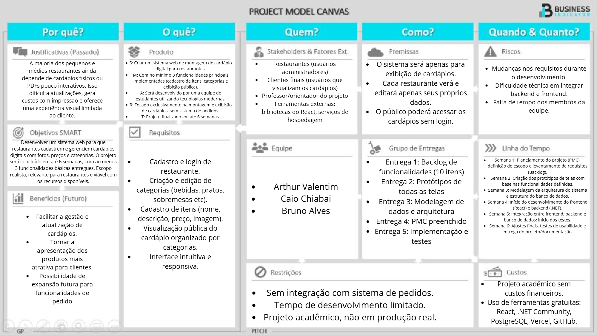
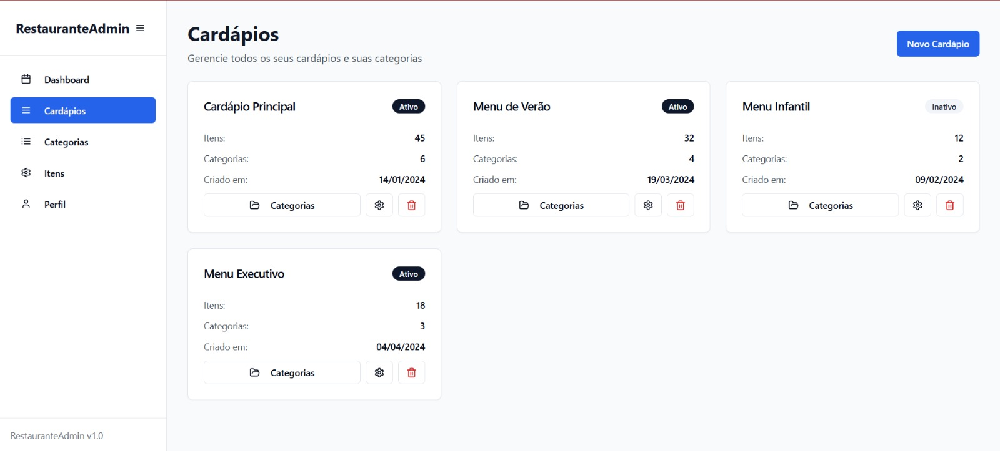
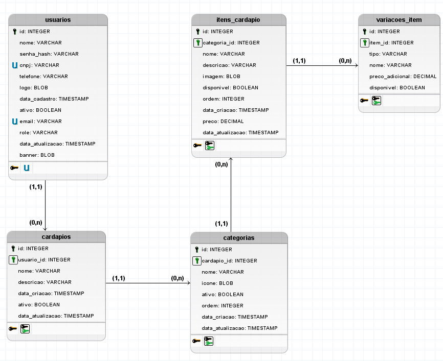

# 📘 Documentação do Projeto - Desenvolvimento Web

## 🧾 Visão Geral

O sistema tem como propósito permitir que estabelecimentos (usuários) gerenciem seus cardápios de forma estruturada, permitindo a criação de categorias, inclusão de itens e variações desses itens, com controle de disponibilidade e preços.

## ✅ Backlog

| ID    | Prioridade | História de Usuário                                                                 |
|-------|------------|--------------------------------------------------------------------------------------|
| HU-1  | 1️⃣         | **No papel de administrador**, desejo **cadastrar um restaurante**, para que ele possa usar a plataforma. |
| HU-2  | 2️⃣         | **No papel de restaurante**, desejo **acessar um painel administrativo com acesso a todos os meus cardápios**, itens e categorias, para facilitar a gestão do sistema. |
| HU-3  | 3️⃣         | **No papel de restaurante**, desejo **me autenticar com email e senha**, para acessar meu painel de administração.|
| HU-4  | 4️⃣         | **No papel de restaurante**, desejo **criar cardápios**, para organizar meus menus por horários ou ocasiões.|
| HU-5  | 5️⃣         | **No papel de restaurante**, desejo **adicionar novos produtos no cardápio**, para poder controlar a ordem de apresentação dos itens.|
| HU-6  | 6️⃣         | **No papel de restaurante**, desejo **criar categorias no cardápio**, para organizar melhor os itens. |
| HU-7  | 7️⃣         | **No papel de cliente**, desejo **visualizar o cardápio completo com imagens e preços**, para escolher o que desejo pedir. |
| HU-8  | 8️⃣         | **No papel de restaurante**, desejo **remover itens do cardápio**, para manter a lista sempre atualizada com produtos disponíveis. |
| HU-9  | 9️⃣         | **No papel de restaurante**, desejo **editar os detalhes dos itens do cardápio**, incluindo imagem, preço, disponibilidade e ordem, para atualizar o cardápio conforme necessário. |
| HU-10 | 🔟         | **No papel de restaurante**, desejo **remover itens do cardápio**, para manter a lista sempre atualizada com produtos disponíveis. |
| HU-11 | 1️⃣1️⃣         | **No papel de restaurante**, desejo **editar meus dados de perfil**, para manter meu perfil atualizado na plataforma.|
| HU-12 | 1️⃣2️⃣        | **No papel de restaurante**, desejo **adicionar e editar variações de um item como tipo, nome, preço adicional e disponibilidade**, para oferecer mais opções ao cliente.|

## 🎨 Protótipo de Telas

Cada funcionalidade descrita no backlog possui ao menos uma tela representando sua interface esperada.

### 🖼️ Protótipo do Requisito HU-2

**Figura 1**:  painel administrativo com acesso a todos os meus cardápios, correspondente ao HU-2.
---

## 🏗 Análise e Projeto 

O projeto  do sistema 

### Modelo 

